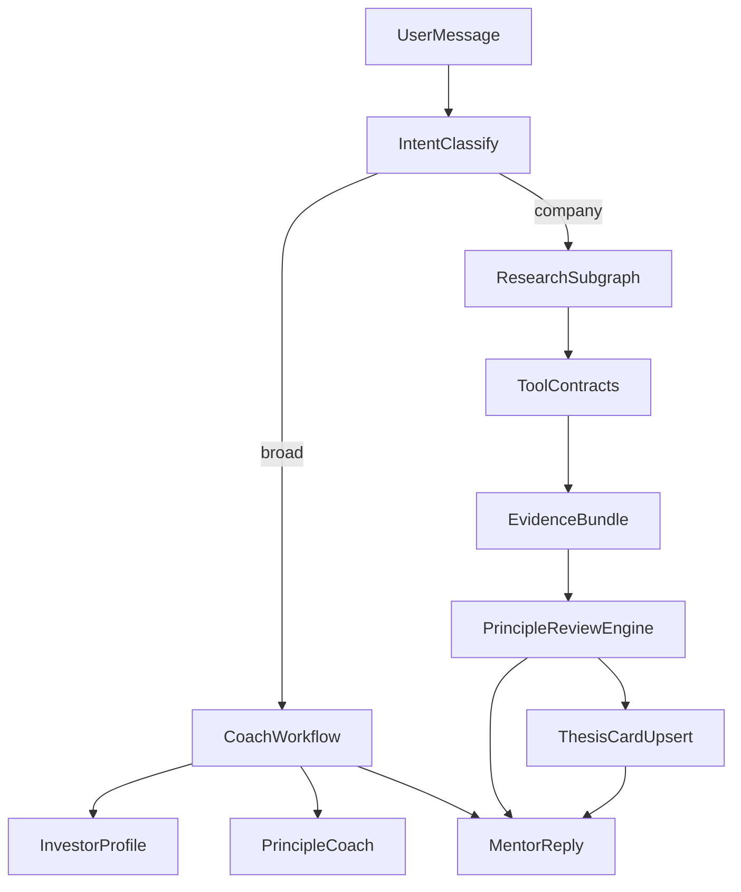

# Architecture

对齐 [VISION.md](../VISION.md)：Workflow + 局部 Agent；宽泛 / 具体公司分流；关键数字以工具为准。

## 栈

| 层 | 选型 |
|---|---|
| Agent | Python 3.11+、LangGraph、Pydantic |
| 本地前端 | CLI（`python -m app.cli`） |
| 可选 API | FastAPI（脚本 / 集成） |
| 存储 MVP | 本地 JSON（档案、论点卡、审查快照） |
| LLM | OpenAI 兼容 API（`OPENAI_API_KEY`）；无 key 时确定性 mock 导师 |

## 模块

```
backend/app/
  cli.py        # 本地长期对话入口（主前端）
  api/          # 可选 HTTP
  domain/       # Profile(+LifeFinance), Session, Review, Thesis…
  principles/   # 清单 + 审查引擎
  tools/        # 工具契约 + Mock
  agent/        # classify → profile extract → coach | research
  store/        # profile / sessions / thesis / reviews JSON
```

## 运行时流程



## 两档路由

| 层 | 谁做 | 规则 |
|---|---|---|
| 意图分类 | LLM 结构化输出 `{mode, symbol_hint}`；无 key / 失败时启发式 fallback | 理解「聊什么」 |
| 标的补全 | `resolve_symbol` / ticker 表 | 校验与归一化 hint |
| **硬护栏** | `run_tool(..., mode=)` | `broad` **禁止**行情/财报/筛股；不靠模型自觉 |
| 数字真源 | 原则引擎 | `company` 审查数字 ⊆ 当次 `ToolResult.numbers` |

`broad`：档案 + 原则教练。`company`：工具 + 审查 + 论点卡。分类失败时 fallback 仅在有标的证据时进 company，避免寒暄误触发工具。

## Context 分层

1. **Profile（语义/事实）**：投资者档案 + 生活财务，几乎每轮注入
2. **Session summary（压缩工作记忆）**：长对话滚动摘要
3. **Episodic memories（检索）**：`memories.jsonl` + BM25 Top-K
4. **Recent window**：近若干轮原文
5. **Artifacts**：论点卡 / 审查 / 工具证据（company 路径）

开放式研究用子图，只把摘要写回主 context，避免膨胀。

## HITL

人决策；系统引导与否决建议。审查输出 `pass | concern | veto`，不自动下单。论点卡由审查后 upsert，用户可在后续对话中修正。

## 评测焦点

- broad 路径 tool call 数 = 0
- 审查数字 ⊆ 工具输出（反幻觉）
- 缺信息时 `missing_info` 非空，而非假装通过
